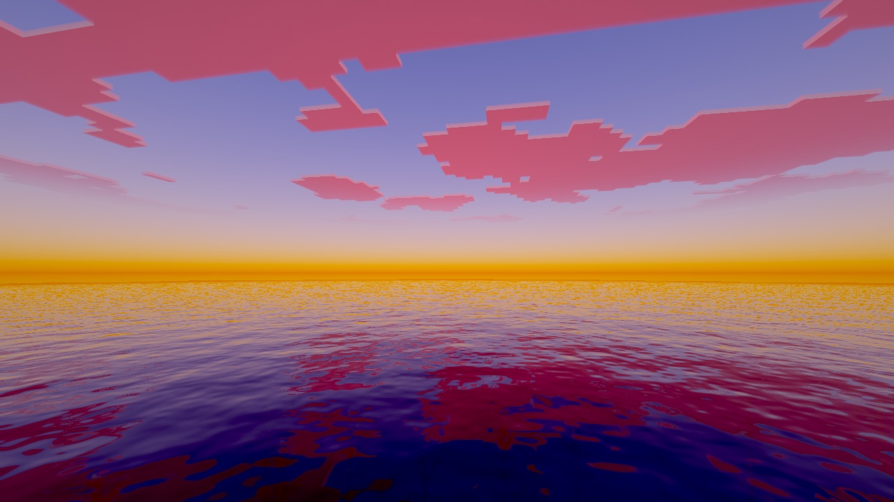
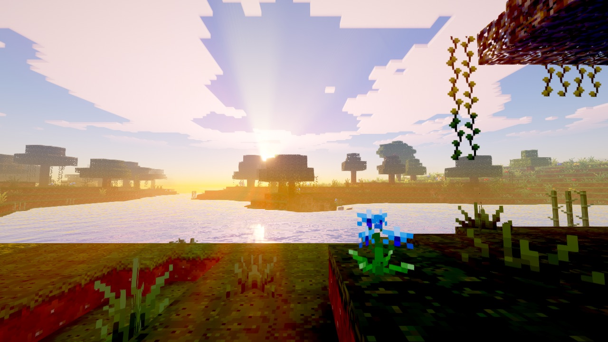
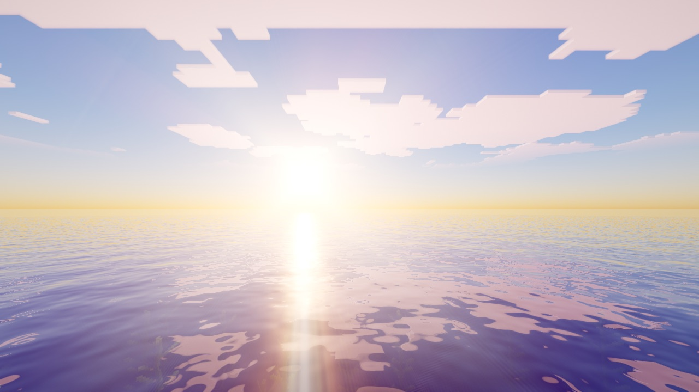
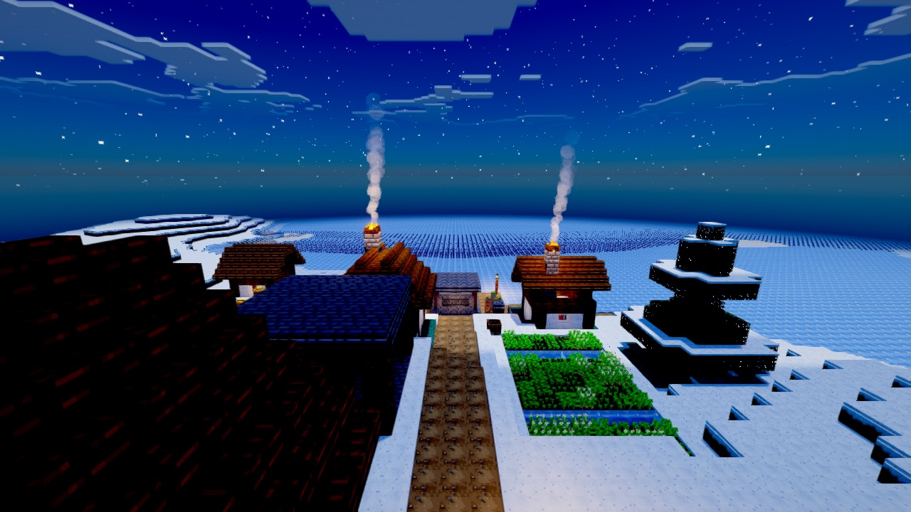
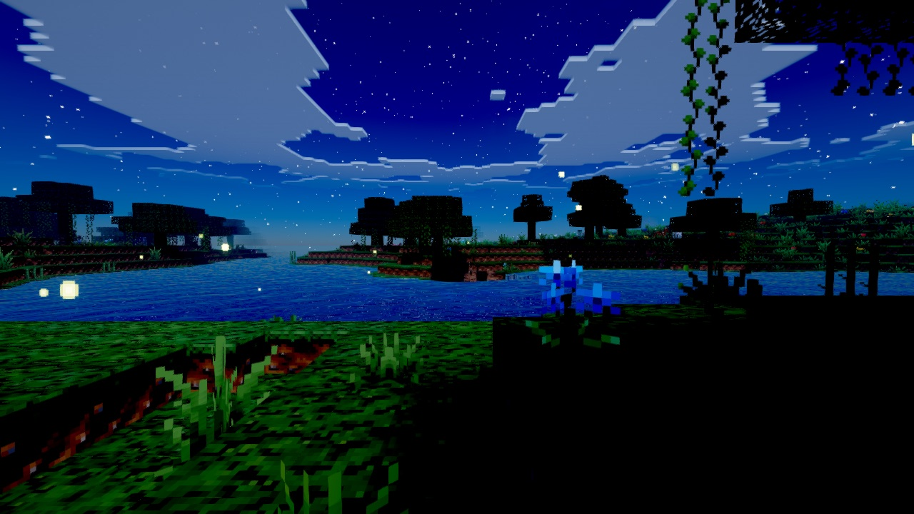
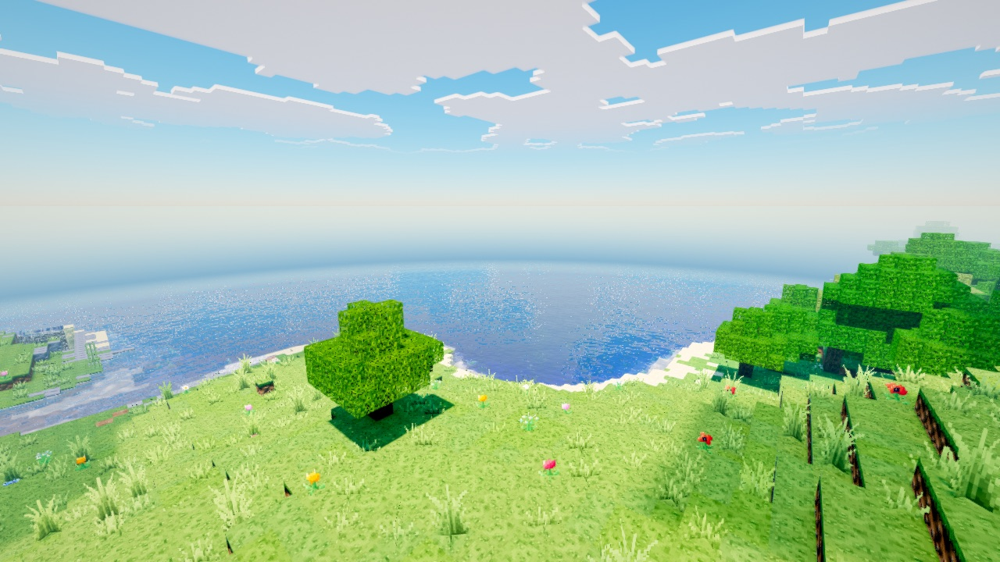
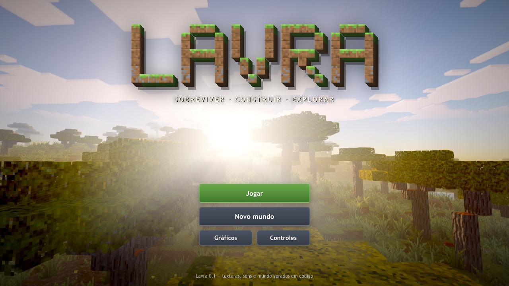

# Lavra

**Jogo sandbox de voxels de sobrevivência e construção que roda direto no navegador.**
Minere, plante, construa, enfrente criaturas à noite e veja o sol se pôr sobre o mar.

*Lavra*: em português, tanto o trabalho de minerar quanto o de cultivar a terra.



| | |
|---|---|
|  |  |
|  |  |
|  |  |

## Tudo gerado em código

O jogo não carrega nenhum arquivo de imagem, modelo ou fonte. As texturas em pixel art (mais de 400 de blocos
e 270 de itens), os modelos e as peles das criaturas, o logotipo, o céu e as nuvens são criados pelo próprio
programa. Os nomes, as criaturas e a interface são próprios. (As imagens acima são capturas do jogo.)

## Como jogar

Abra o link publicado (ou rode localmente, abaixo), clique em **Jogar** e depois na tela para capturar o mouse.

| Tecla | Ação |
|---|---|
| W A S D | andar |
| Espaço | pular / nadar para cima |
| Shift / Ctrl | agachar / correr |
| Botão esquerdo / direito | quebrar e atacar / usar e colocar |
| Botão do meio | pegar o bloco mirado |
| 1–9 ou roda do mouse | escolher item |
| E | inventário (com livro de receitas) |
| Q / F | soltar item / trocar de mão |
| F5 / F1 / F3 | câmera / esconder interface / depuração |
| Esc | pausa (gráficos e controles) |

**Novo mundo** aceita uma semente. Na tela de gráficos há os níveis Baixa, Média, Alta e Ultra e ajustes finos
(distância de visão, sombras, nuvens, brilho e raios de sol, reflexos, partículas, resolução).

## O que tem

- **Mundo**: 37 biomas com transições suaves, montanhas, penhascos, rios, cavernas de três tipos, ravinas, aquíferos,
  minérios por profundidade e vilas por bioma (casas, fazendas, poço, oficinas, praça e chaminés).
- **Sobrevivência fiel ao original**: 20 ticks por segundo, dia de 20 minutos, física do jogador com os mesmos
  números, tempos de quebra, fome e saciedade, dano de queda, afogamento, experiência, cama.
- **Itens e crafting**: inventário completo, bancada 2×2 e 3×3, fornalha, baús, ferramentas, armas, arco, escudo e
  armaduras.
- **Criaturas**: vaca, porco, ovelha, galinha d'angola, tapiti, cavalo crioulo, lobo-guará, gato, peixes, Musgarto,
  e à noite Carniçal, Ossudo, Tecelã, Pavio, Feiticeira, Gosma, Assombro, Náufrago, Vulto e Espreitador.
  A IA usa objetivos e A* na grade de voxels.
- **Aldeões** com profissões, rotina, comércio em níveis e uma Sentinela que protege a vila.
- **Água e lava** escorrendo, agricultura com irrigação e **circuitos de fulgor** (fio, tocha, repetidor,
  comparador, pistões, observador, TNT…).
- **Gráficos**:
  - céu físico (dispersão atmosférica) com pores do sol dourados e crepúsculos roxos;
  - sol quadrado em pixel art, lua com fases e estrelas que giram;
  - nuvens em blocos iluminadas pelo sol e pela lua;
  - sombras em cascata suaves e folhas translúcidas;
  - água com reflexos, trilha do sol cintilante, refração e espuma;
  - névoa baixa ao entardecer e raios de sol;
  - bloom, lens flare, exposição automática e gradação de cor por hora do dia;
  - vento nas plantas, superfícies molhadas na chuva;
  - partículas: fumaça de chaminés e fogueiras, vaga-lumes, folhas caindo, chuva, neve e detritos.

## Rodar localmente

Requer Node 20 ou mais novo.

```bash
npm install
npm run dev        # http://localhost:5174
npm run build      # gera dist/ (site estático)
npm test           # testes de lógica (Vitest)
npm run e2e        # testes com o jogo rodando (Playwright)
```

Parâmetros de URL úteis para desenvolvimento: `?seed=abc&pos=100,80,200&time=12500&mode=creative&rd=12`
(eles pulam a tela inicial).

## Tecnologia

TypeScript, Vite e Three.js, com um renderizador próprio de chunks em WebGL2 puro (um VAO por seção, vértices
compactados em 12 bytes, culling de cavernas). A geração do mundo e as malhas rodam em Web Workers. A cena é
renderizada em HDR com um pipeline próprio: LUT do céu, sombras em cascata, atmosfera e nuvens, água, partículas
e pós-processamento. Detalhes e decisões em [DESIGN.md](DESIGN.md); andamento em [PROGRESSO.md](PROGRESSO.md).

Requer um navegador com WebGL2 (Chrome, Edge, Firefox ou Safari atuais).
